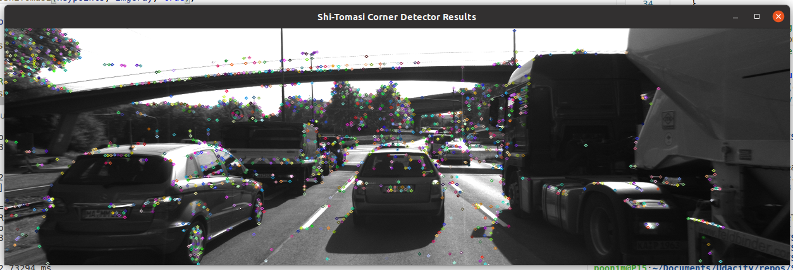

# SFND 2D Feature Tracking

## Basic Build Instructions
1. Clone this repo.
2. Make a build directory in the top level directory: `mkdir build && cd build`
3. Compile: `cmake .. && make`
4. Run it: `./2D_feature_tracking`.

## Install OpenCV on Ubuntu machine
Steps to install are taken from [OpenCV's official instructions](https://docs.opencv.org/master/d7/d9f/tutorial_linux_install.html), but since we are going to use some algorithms from `xfeatures2d.hpp` and `xfeatures2d/nonfree.hpp` an additional flags need to be set.

```
# Download and unpack sources
wget -O opencv.zip https://github.com/opencv/opencv/archive/master.zip
wget -O opencv_contrib.zip https://github.com/opencv/opencv_contrib/archive/master.zip
unzip opencv.zip
unzip opencv_contrib.zip

# Create build directory and switch into it
mkdir -p build && cd build

# Configure, need to set flag for non-free, and contrib (extra module)
# --Note-- Check note below.
cmake -DOPENCV_ENABLE_NONFREE=ON -DOPENCV_EXTRA_MODULES_PATH=../opencv_contrib-master/modules ../opencv-master

# Build (this step will take quite long)
cmake --build .
make -j8

# Install
sudo make install
```

In configure step, make sure to check an output message. It should show something similar to the following lines.
```
<some other messages>
...
-- Configuring done
-- Generating done
-- Build files have been written to: /home/xxx/Documents/Udacity/build
```
If not, you problably missing some required libraries. Read through the output messages to figure out what's missing, then delete and create another build directory and try to run the configure command again.

## Make Visual Studio recognize OpenCV
After install OpenCV successfully, you will have the following directory installed on your system (with default install path).

- `/usr/local/bin` - executable files
- `/usr/local/lib` - libraries (.so)
- `/usr/local/cmake/opencv4` - cmake packages
- `/usr/local/include/opencv4` - headers
- `/usr/local/share/opencv4` - other files

In Visual Studio Code:
- Press `Ctrl+Shift+p` to bring up the drop-down menu.
- Select `C/C++: Edit Configurations (UI)`
- In `C/C++ Configurations` tab, in `Include path` section, put in OpenCV's header directory's path.
- Put path to header file directory as `/usr/local/include/opencv4/**`, the preceeding `/**` tell the IDE to search for header files within the subfolders as well.

|  | 
|:--:| 
| *Dropdown menu pop-up after press `Ctrl+Shift+p`* |

|  | 
|:--:| 
| *In `Include path` section, add `/usr/local/include/opencv4/**`* |


When done, you should be able to see a command list
|  | 
|:--:| 
| *command pallete* |

## Comparing Detector performance
### Shi-Tomasi Detector
**Note :** Keypoints are dense and distributed across the frame.
|  | 
|:--:| 
| *Shi-Tomasi Detector* |

| frame | in focus / overall frame| time taken (ms) |
| :---: | :---: | :---: |
| 1 | 125 / 1,370  | 12.2891  |
| 2 | 118 / 1,301  | 10.5040  |
| 3 | 123 / 1,361  | 12.1816  |
| 4 | 120 / 1,358  | 25.8814  |
| 5 | 120 / 1,333  | 26.3410  |
| 6 | 112 / 1,284  | 10.3645  |
| 7 | 114 / 1,322  | 12.6713  |
| 8 | 123 / 1,366  | 26.7295  |
| 9 | 111 / 1,389  | 10.3175  |
| 10 | 112/ 1,339  | 23.3157  |

### Harris Detector
**Note :** Provide very few keypoints compare to other methods.
|  | 
|:--:| 
| *Harris Detector* |

| frame | in focus / overall frame| time taken (ms) |
| :---: | :---: | :---: |
| 1 | 17 / 115  | 13.1214  |
| 2 | 14 / 98   | 9.98241  |
| 3 | 18 / 113  | 9.41177  |
| 4 | 21 / 121  | 11.7941  |
| 5 | 26 / 160  | 19.0837  |
| 6 | 43 / 383  | 21.7991  |
| 7 | 18 / 85   | 10.3319  |
| 8 | 31 / 210  | 13.4019  |
| 9 | 26 / 171  | 10.8883  |
| 10 | 34 / 281 | 14.1609  |

### BRISK Detector
**Note :** Provide dense keypoints with different sizes and lots of overlapping. Many keypoints are on feature like overhead bridge and trees, which is irrelevant to us.
|  | 
|:--:| 
| *BRISK Detector* |

| frame | in focus / overall frame| time taken (ms) |
| :---: | :---: | :---: |
| 1 | 264 / 2,754  | 34.4952 |
| 2 | 282 / 2,777  | 33.5084 |
| 3 | 282 / 2,741  | 35.5564 |
| 4 | 277 / 2,735  | 33.5147 |
| 5 | 297 / 2,757  | 32.6085 |
| 6 | 279 / 2,695  | 32.7244 |
| 7 | 289 / 2,715  | 32.6185 |
| 8 | 272 / 2,628  | 31.9206 |
| 9 | 266 / 2,639  | 32.1965 |
| 10 | 254 / 2,672  | 31.9817 |

### ORB Detector
**Note :** Majority of keypoints are overlapping and have about the same size. Good amount of keypoints are in our focus area (more than 20%).
|  | 
|:--:| 
| *ORB Detector* |

| frame | in focus / overall frame| time taken (ms) |
| :---: | :---: | :---: |
| 1 | 92 / 500  | 97.0611 |
| 2 | 102 / 500 | 5.69152 |
| 3 | 106 / 500 | 5.91319 |
| 4 | 113 / 500 | 5.91422 |
| 5 | 109 / 500 | 5.91738 |
| 6 | 125 / 500 | 6.58725 |
| 7 | 130 / 500 | 5.82986 |
| 8 | 129 / 500 | 5.75667 |
| 9 | 127 / 500 | 6.22600 |
| 10 | 128 / 500 | 6.42212|

### AKAZE Detector
**Note :** Keypoints are distribute evenly across the frame, not many of them overlapping. Most of the keypoints have the same size.
|  | 
|:--:| 
| *AKAZE Detector* |

| frame | in focus / overall frame| time taken (ms) |
| :---: | :---: | :---: |
| 1 | 166 / 1,351  | 49.1474 |
| 2 | 157 / 1,327  | 46.4223 |
| 3 | 161 / 1,311  | 57.9569 |
| 4 | 155 / 1,351  | 55.1364 |
| 5 | 163 / 1,360  | 45.0736 |
| 6 | 164 / 1,347  | 45.2190 |
| 7 | 173 / 1,363  | 47.7028 |
| 8 | 175 / 1,331  | 50.1518 |
| 9 | 177 / 1,358  | 45.2005 |
| 10 | 179 / 1,331 | 47.6290 |

### SIFT Detector
**Note :** Keypoint are of the difference size, few of them are overlapping.
|  | 
|:--:| 
| *SIFT Detector* |

| frame | in focus / overall frame| time taken (ms) |
| :---: | :---: | :---: |
| 1 | 138 / 1,438 | 96.0854 |
| 2 | 132 / 1,371 | 75.8349 |
| 3 | 124 / 1,380 | 76.8312 |
| 4 | 137 / 1,335 | 73.9495 |
| 5 | 134 / 1,305 | 75.2970 |
| 6 | 140 / 1,369 | 76.7962 |
| 7 | 137 / 1,396 | 93.4424 |
| 8 | 148 / 1,382 | 77.3562 |
| 9 | 159 / 1,463 | 77.3701 |
| 10 | 137 / 1,422| 76.7884 |
